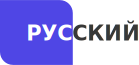
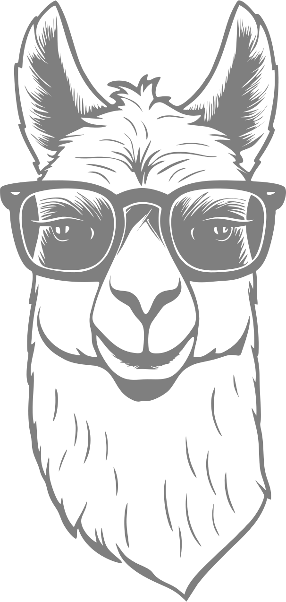
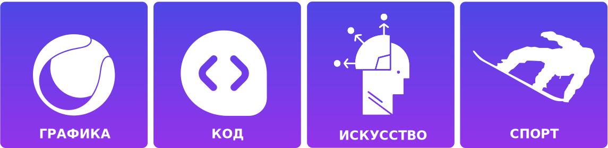
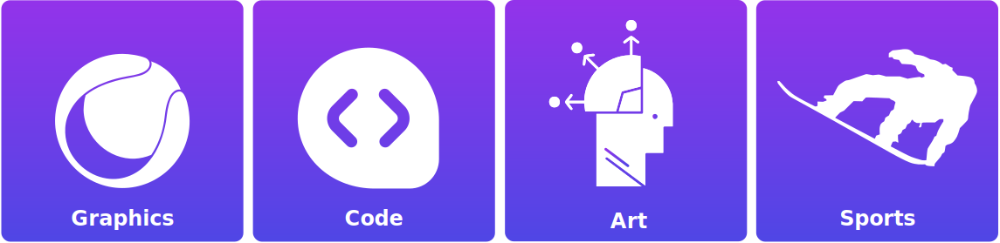

      <a href="#english">
  <picture>
    <source srcset="assets/len.svg" media="(prefers-color-scheme: dark)">
    
  </picture>
</a>
      <a href="#russian">
  <picture>
    <source srcset="assets/lru.svg" media="(prefers-color-scheme: dark)">
    
  </picture>
</a>
    <a href="mailto:kirikov_08@mail.ru">
  <picture>
    <source srcset="assets/zm.svg" media="(prefers-color-scheme: dark)">
    
  </picture>
</a>
   <a href="https://t.me/Kovtun_Kirill" target="_blank">
  <picture>
    <source srcset="assets/zt.svg" media="(prefers-color-scheme: dark)">
    
  </picture>
</a>

 

  <picture>
    
  </picture>

  

    <picture>
      <source srcset="assets/Ru_b.svg" media="(prefers-color-scheme: dark)">
      
    </picture>
  

<h2>Здравствуйте, я Ковтун Кирилл!</h2>
<b>Руководитель проектов | Руководитель управления IT-аналитики</b>
 г. Москва

  
  

  <picture>
    <source srcset="assets/navinu_t.svg" media="(prefers-color-scheme: dark)">
    
  </picture>

  

  
  
  
  
  
  
  
  
  
  
  
  
  
  
  
  
  
  
  
  
  
  
  
  

  

  <picture>
    <source srcset="assets/linfo_b.svg" media="(prefers-color-scheme: dark)">
    
  </picture>

  
   
  <b>- 7 лет</b> опыта в digital для госсектора 
  <b>- Эксперт:</b> управление командами, аналитика, автоматизация 
  - Люблю строить и внедрять новые решения 
  <i>- Сделаю больше с меньшими ресурсами!</i>

  
  

  <picture>
    <source srcset="assets/proj_b.svg" media="(prefers-color-scheme: dark)">
    
  </picture>

<table align="center">
  <tr>
    <th align="center">Роль</th>
    <th align="center">Проекты</th>
    <th align="center">Достижения</th>
  </tr>
  <tr>
    <td align="left">
      
    </td>
    <td><b>АИС для межблокового взаимодействия ФОИВ РФ</b></td>
    <td>
      Руководство командой 
      Проектирование и запуск 
      Backend/frontend, UX/UI 
      
    </td>
  </tr>
  <tr>
    <td align="left">
      
    </td>
    </td>
    <td><b>АИС для Минстроя России (8+ модулей)</b></td>
    <td>
      5000+ пользователей 
      Интеграция 
      Мобильное приложение 
      <a href="https://patents.sudrf.ru/patents/patent/ru/2024665653" target="_blank">
<!--          -->
      </a>
    </td>
  </tr>
  <tr>
    <td align="left">
      
    </td>
    <td><b>Аналитические дашборды, Telegram-боты</b></td>
    <td>
      Power BI 
      Google Script 
      Telegram API 
      Автоматизация отчётности
    </td>
  </tr>
  <tr>
    <td align="left">
      
    </td>
    <td><b>Цифровая инфраструктура для МинЖКХ МО</b></td>
    <td>
      Google Apps Script 
      Внедрение, аналитика 
      Поддержка пользователей
    </td>
  </tr>
</table>

  

  <picture>
    <source srcset="assets/cubok_b.svg" media="(prefers-color-scheme: dark)">
    
  </picture>

- Благодарственные письма **Минстроя РФ**
- Благодарственные письма **МинЖКХ Московской области**

  
  

  <picture>
    <source srcset="assets/lk_b.svg" media="(prefers-color-scheme: dark)">
    
  </picture>

**- Организатор** • **Лидер** • _Аналитик_  
- Быстро адаптируюсь
• Стрессоустойчив
• Планирую наперёд  
- Ориентир на результат

  
  

  <picture>
    <source srcset="assets/inter_b.svg" media="(prefers-color-scheme: dark)">
    
  </picture>

  <picture>
    <source srcset="assets//interes_b1.svg" media="(prefers-color-scheme: dark)">
    
  </picture>

  

  <picture>
    <source srcset="assets/princ_b.svg" media="(prefers-color-scheme: dark)">
    
  </picture>

  - Прозрачность и доверие — залог сильной команды  
  - Фокус на результат и развитие людей  
  - Люблю создавать и внедрять новые решения

  

  <a href="#top">
    <picture>
      <source srcset="assets/Vver_t.svg" media="(prefers-color-scheme: dark)">
      
    </picture>
  </a>

---

  

    <picture>
      <source srcset="assets/En_b1.svg" media="(prefers-color-scheme: dark)">
      
    </picture>
  

<h2>Hello, I'm Kirill Kovtun!</h2>
<b>Project Manager | Head of IT Analytics Department</b>
 Moscow, Russia

  

  <picture>
    <source srcset="assets/en_st_b.svg" media="(prefers-color-scheme: dark)">
    
  </picture>

  

  
  
  
  
  
  
  
  
  
  
  
  
  
  
  
  
  
  
  
  
  
  
  
  

  

  <picture>
    <source srcset="assets/en_ab_b.svg" media="(prefers-color-scheme: dark)">
    
  </picture>

  
   
  <b>- 7 years</b> of experience in digital for government sector 
  <b>- Expert:</b> team management, analytics, automation 
  - Passionate about building and implementing new solutions 
  <i>- Achieve more with fewer resources!</i>

  
  

  <picture>
    <source srcset="assets/en_proj_b.svg" media="(prefers-color-scheme: dark)">
    
  </picture>

<table align="center">
  <tr>
    <th align="center">Role</th>
    <th align="center">Project</th>
    <th align="center">Achievements</th>
  </tr>
  <tr>
    <td align="left">
      
    </td>
    <td><b>Interdepartmental System for Russian Federal Agencies</b></td>
    <td>
      Team management 
      Design and launch 
      Backend/frontend, UX/UI 
      
    </td>
  </tr>
  <tr>
    <td align="left">
      
    </td>
    <td><b>System for the Ministry of Construction of Russia (8+ modules)</b></td>
    <td>
      5000+ users 
      Integration 
      Mobile application 
      <a href="https://patents.sudrf.ru/patents/patent/ru/2024665653" target="_blank">
<!--          -->
      </a>
    </td>
  </tr>
  <tr>
    <td align="left">
      
    </td>
    <td><b>Analytics Dashboards, Telegram Bots</b></td>
    <td>
      Power BI 
      Google Script 
      Telegram API 
      Reporting automation
    </td>
  </tr>
  <tr>
    <td align="left">
      
    </td>
    <td><b>Digital Infrastructure for the Ministry of Housing and Public Utilities of Moscow Region</b></td>
    <td>
      Google Apps Script 
      Implementation, analytics 
      User support
    </td>
  </tr>
</table>

  

  <picture>
    <source srcset="assets/en_cubok_b.svg" media="(prefers-color-scheme: dark)">
    
  </picture>

- Letters of gratitude from the Ministry of Construction of the Russian Federation
- Letters of gratitude from the Ministry of Housing and Public Utilities of the Moscow Region

  
  

  <picture>
    <source srcset="assets/en_ss_b.svg" media="(prefers-color-scheme: dark)">
    
  </picture>

**- Organizer** • **Leader** • _Analyst_  
- Fast adaptability  
• Stress resistant  
• Strategic planning  
- Result-oriented

  
  

  <picture>
    <source srcset="assets/en_inter_b.svg" media="(prefers-color-scheme: dark)">
    
  </picture>

  <picture>
    <source srcset="assets/en_interes_b.svg" media="(prefers-color-scheme: dark)">
    
  </picture>

  

  <picture>
    <source srcset="assets/en_princ_b.svg" media="(prefers-color-scheme: dark)">
    
  </picture>

  - Transparency and trust are the foundation of a strong team  
  - Focus on results and team growth  
  - I love creating and implementing new solutions

  

  <a href="#top">
    <picture>
      <source srcset="assets/vvEn_b.svg" media="(prefers-color-scheme: dark)">
      
    </picture>
  </a>

